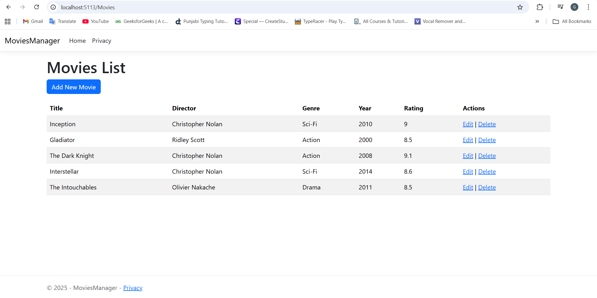

# 🎥 MoviesManager

A simple **C# ASP.NET Core MVC** web application built to manage movies.  
This project was created to practice and demonstrate key concepts of **C#**, **Entity Framework Core**, and **ASP.NET MVC architecture**.

---

## 🚀 Features
- Add, edit, and delete movies  
- View and search a list of movies  
- Filter by genre and rating  
- Built using the **Model–View–Controller (MVC)** design pattern  
- Responsive layout using **Bootstrap 5**

---

## 🧰 Tech Stack
- **Language:** C#  
- **Framework:** .NET (ASP.NET Core MVC)  
- **Database:** SQL Server / LocalDB via Entity Framework Core  
- **IDE:** Visual Studio / VS Code  

---

## 🖼️ Preview


---

## ⚙️ Run Locally
1. Clone the repository  
   ```bash
   git clone https://github.com/gureevirdi/MoviesManager.git
